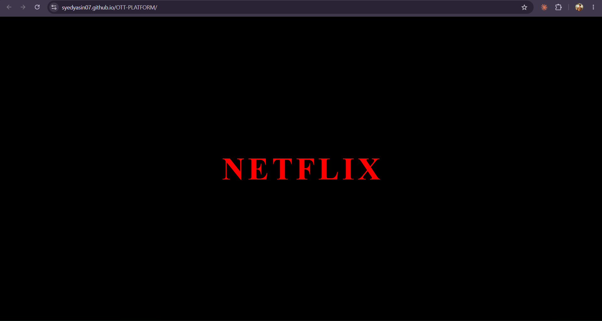

# 🎬 OTT Platform (Work In Progress)


A Netflix-inspired OTT streaming platform currently under development. The project aims to replicate the user experience of modern streaming services through interactive UI design, smooth animations, responsive layouts, and dynamic content management.

The current version includes a custom animated intro screen inspired by the Netflix startup experience and serves as the foundation for future platform development.

---

# 🌐 Live Demo

🔗 https://syedyasin07.github.io/OTT-PLATFORM/

---

# 📖 Project Overview

This project is being developed to explore modern frontend development concepts including:

* UI/UX Design
* CSS Animations
* Responsive Web Design
* JavaScript DOM Manipulation
* Interactive User Experiences

The long-term goal is to build a complete OTT platform featuring movie browsing, categories, search functionality, user profiles, watchlists, and streaming-inspired interfaces.

---

# ✨ Current Features

## 🎥 Netflix-Style Intro Animation

* Animated Netflix Logo Reveal
* Sequential Letter Animations
* Audio Playback Support
* Full-Screen Intro Experience
* Responsive Layout
* Smooth CSS Transitions

---

# 🛠️ Technology Stack

## Frontend

* HTML5
* CSS3
* JavaScript

## Deployment

* GitHub Pages

---

# 🏗️ Current Architecture

```text
User
 │
 ▼
HTML Structure
 │
 ▼
CSS Animations
 │
 ▼
JavaScript Events
 │
 ▼
Interactive Intro Experience
```

---

# 📸 Project Screenshot

## Netflix Intro Screen



---

# 🚀 Installation

### Clone Repository

```bash
git clone https://github.com/SyedYasin07/OTT-PLATFORM.git
```

### Navigate To Project

```bash
cd OTT-PLATFORM
```

### Run Locally

Open:

```text
index.html
```

Or use VS Code Live Server.

---

# 🎯 Learning Outcomes

This project demonstrates:

* CSS Keyframe Animations
* JavaScript Event Handling
* Audio Integration
* Responsive Web Design
* Frontend Development Fundamentals
* UI Recreation Techniques

---

# 🚧 Planned Features

## Phase 1

* Landing Page
* Movie Categories
* Featured Content Section
* Responsive Navigation Bar

## Phase 2

* Search Functionality
* Movie Details Pages
* Watchlist System
* User Authentication

## Phase 3

* React.js Migration
* API Integration
* Dynamic Content Loading
* Advanced UI Components

---

# 📈 Future Enhancements

* React.js Architecture
* Movie Database API Integration
* User Profiles
* Watch History
* Personalized Recommendations
* Dark Theme Optimization
* Video Streaming Simulation

---

# 👨‍💻 Author

### Syed Yasin

**Live Project**

https://syedyasin07.github.io/OTT-PLATFORM/

**GitHub**

https://github.com/SyedYasin07

---

# ⭐ Support

If you found this project interesting, consider giving it a Star ⭐ on GitHub.

More features and updates are planned as development continues.


